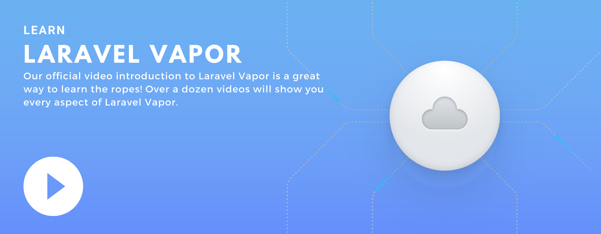

# Introduction

[[toc]]

## What Is Vapor?

Laravel Vapor is an auto-scaling, serverless deployment platform for Laravel, powered by AWS Lambda. Manage your Laravel infrastructure on Vapor and fall in love with the scalability and simplicity of serverless.

Vapor abstracts the complexity of managing Laravel applications on AWS Lambda, as well as interfacing those applications with SQS queues, databases, Redis clusters, networks, CloudFront CDN, and more. Some highlights of Vapor's features include:

- Auto-scaling web / queue infrastructure fine tuned for Laravel
- Zero-downtime deployments and rollbacks
- Environment variable / secret management
- Database management, including point-in-time restores and scaling
- Redis Cache management, including cluster scaling
- Database and cache tunnels, allowing for easy local inspection
- Automatic uploading of assets to Cloudfront CDN during deployment
- Unique, Vapor assigned vanity URLs for each environment, allowing immediate inspection
- Custom application domains
- DNS management
- Certificate management and renewal
- Application, database, and cache metrics
- CI friendly

**In short, you can think of Vapor as [Laravel Forge](https://forge.laravel.com) for serverless technology.**

### Video Series

We've created a comprehensive and free video series on Vapor. With 2 hours of content, our team will help you launch your Laravel infrastructure on Vapor and fall in love with the scalable simplicity of serverless.

[](https://www.youtube.com/watch?v=4WvRChmRhDo&list=PLcjapmjyX17gqhjUz8mgTaWzSv1FPgePD)

## Requirements

Vapor requires that your application be compatible with PHP 7.3+ and Laravel 6.0+.

## Account Creation

Before integrating Vapor into your application, you should create a Vapor account. If you are just collaborating with others on their projects, you are not required to have a Vapor subscription. To create and manage your own projects, you will need a Vapor subscription.

## Installing The Vapor CLI

You will deploy your Laravel Vapor applications using the [Vapor CLI](https://github.com/laravel/vapor-cli). This CLI may be installed globally or on a per-project basis using Composer:

```bash
composer require laravel/vapor-cli --update-with-dependencies

composer global require laravel/vapor-cli --update-with-dependencies
```

When the CLI is installed per project, you will likely need to execute it via the `vendor/bin` directory of your project, which is where Composer installs executables. For example, to view all of the available Vapor CLI commands, you may use the `list` command:

```bash
php vendor/bin/vapor list
```

:::tip Vapor CLI Alias

To save keystrokes when interacting with per-project installations of the Vapor CLI, you may add a shell alias to your operating system that aliases the `vapor` command to `php vendor/bin/vapor`.
:::

To learn more about a command and its arguments, execute the `help` command with the name of the command you wish to explore:

```bash
php vendor/bin/vapor help deploy
```

### Logging In

After you have installed the Vapor CLI, you should authenticate with your Vapor account using the `login` command:

```bash
vapor login
```

## Installing The Vapor Core

The `laravel/vapor-core` [package](https://github.com/laravel/vapor-core) must be installed as a dependency of every Laravel application that is deployed using Vapor. This package contains various Vapor runtime files and a service provider to allow your application to run on Vapor. You may install the Vapor Core into your project using Composer:

```bash
composer require laravel/vapor-core --update-with-dependencies
```

## Installing The Vapor UI Dashboard

In addition, you may want to install the `laravel/vapor-ui` [package](https://github.com/laravel/vapor-ui). This package provides a beautiful dashboard through your application that allows you to monitor your application's logs and failed queue jobs. After deploying your application to Vapor, the dashboard will be available at the `/vapor-ui` URI. The Vapor UI dashboard package can be installed in your project using Composer:

```bash
composer require laravel/vapor-ui
```

After installing Vapor UI, you may publish its assets using the `vapor-ui:install` Artisan command:

```bash
php artisan vapor-ui:install
```

Of course, you will need to deploy your application to begin using the dashboard. After deploying your application to Vapor, the dashboard will be available at the `/vapor-ui` URI.

### Dashboard Authorization

Vapor UI exposes a dashboard at the `/vapor-ui` URI. Within your `app/Providers/VaporUiServiceProvider.php` file, there is a `gate` method that controls access to the Vapor UI dashboard. By default, all visitors are restricted. You should modify this gate as needed to grant access to your Vapor UI dashboard:

```php
/**
 * Register the Vapor UI gate.
 *
 * This gate determines who can access Vapor UI in non-local environments.
 *
 * @return void
 */
protected function gate()
{
    Gate::define('viewVaporUI', function ($user = null) {
        return in_array(optional($user)->email, [
            'taylor@laravel.com',
        ]);
    });
}
```

### Upgrading Vapor UI

When upgrading to a new version of Vapor UI, you should re-publish Vapor UI's assets:

```bash
php artisan vapor-ui:publish
```

To keep the assets up-to-date and avoid issues in future updates, you may add the `vapor-ui:publish` command to the `post-update-cmd` scripts in your application's `composer.json` file:

```json
{
    "scripts": {
        "post-update-cmd": [
            "@php artisan vapor-ui:publish --ansi"
        ]
    }
}
```

### Customizing Middleware

If needed, you can customize the middleware stack used by Vapor UI routes by updating your `config/vapor-ui.php` file. If you have not published Vapor UI's configuration file, you may do so using the `vendor:publish` Artisan command:

```
php artisan vendor:publish --tag=vapor-ui-config
```

Once the configuration file has been published, you may edit Vapor UI's middleware by tweaking the `middleware` configuration option within this file:

```php
/*
|--------------------------------------------------------------------------
| Vapor UI Route Middleware
|--------------------------------------------------------------------------
|
| These middleware will be assigned to every Vapor UI route - giving you
| the chance to add your own middleware to this list or change any of
| the existing middleware. Or, you can simply stick with this list.
|
*/

'middleware' => [
    'web',
    EnsureUserIsAuthorized::class,
    EnsureEnvironmentVariables::class,
    EnsureUpToDateAssets::class,
],
```

## Sandbox Accounts

After creating a Vapor account, your account will be on our free "sandbox" plan, which allows you to experience the power of Vapor without the upfront commitment of subscribing to a paid plan. A sandbox account allows you to provision services such as networks, databases, and caches. You may add a single project which, once deployed, will be accessible via an [AWS Lambda function URL](https://docs.aws.amazon.com/lambda/latest/dg/lambda-urls.html).

:::warning Sandbox Limitations

Sandbox projects may not utilize API Gateway versions, load balancers, firewalls, or custom domains. To utilize these features, you will need to choose a subscription plan.
:::

## Teams

When you create your Vapor account, a "Personal" team is automatically created for you. You can rename this team in your team settings. All projects, databases, caches, and other Vapor resources belong to a team. You are free to create as many teams as you wish via the Vapor UI or the `team` CLI command. There is no additional charge for creating teams, and they serve as a great way to organize your projects by client or topic.

### Current Team & Switching Teams

When managing Vapor resources via the CLI, you will need to be aware of your currently active team. You may view your current team using the `team:current` command:

```bash
vapor team:current
```

To change your active team, you may use the `team:switch` command:

```bash
vapor team:switch
```

### Collaborators

You can invite more people to your team via the "Team Settings" menu in the Vapor UI, or using the `team:add` CLI command. When you add a new collaborator to your team via the Vapor UI, you may select the permissions to assign to that person. For example, you can prevent a given team member from deleting databases or caches.

You may remove collaborators from your team using the Vapor UI or `team:remove` CLI command.

## Linking With AWS

In order to deploy projects or create other resources using Vapor, you will need to link an active AWS account on your team's settings management page.

### Creating An IAM User

To create the AWS access key and secret required by Vapor to manage resources on your AWS account, you will need to create a new IAM user within AWS. To create a new IAM user, navigate to the IAM service on your AWS dashboard. Once you are in the IAM dashboard, you may select "Users" from the left-side navigation panel.

Next, click the "Add user" button and choose a user name. When selecting an "Access type", select "Programmatic access". This instructs AWS IAM to issue a access key ID and secret access key for the IAM user. Then, click "Next".

#### Permissions

:::tip IAM Access

Since Vapor manages many types of resources across more than a dozen AWS services, it may be convenient to create a user with the `AdministratorAccess` policy. If desired, you may create a separate AWS account to house this user and contain all of your Vapor resources.
:::

On the permissions management screen, you may grant full administrator access to the IAM user by selecting the "Attach existing policies directly" option and "AdministratorAccess" policy. Once the policy has been attached, you may click "Next".

Or, if you would prefer to not provide administrator access to Vapor, you may instead create a custom permission policy with the specific permissions needed by Vapor. To do so, select "Policies" from the IAM service within the AWS console, followed by "Create policy". Choose the JSON option and provide the permission definition below. Once the policy has been defined, you may attach the policy to your new IAM user:

```json
{
    "Version": "2012-10-17",
    "Statement": [
        {
            "Sid": "VaporPolicy",
            "Effect": "Allow",
            "Action": [
                "acm:AddTagsToCertificate",
                "acm:DeleteCertificate",
                "acm:DescribeCertificate",
                "acm:ImportCertificate",
                "acm:RequestCertificate",
                "apigateway:DELETE",
                "apigateway:GET",
                "apigateway:PATCH",
                "apigateway:POST",
                "apigateway:PUT",
                "apigateway:SetWebACL",
                "budgets:ModifyBudget",
                "budgets:ViewBudget",
                "cloudformation:CreateStack",
                "cloudformation:DeleteStack",
                "cloudformation:DescribeStacks",
                "cloudformation:UpdateStack",
                "cloudfront:CreateDistribution",
                "cloudfront:DeleteDistribution",
                "cloudfront:GetDistribution",
                "cloudfront:GetDistributionConfig",
                "cloudfront:UpdateDistribution",
                "cloudwatch:DeleteAlarms",
                "cloudwatch:GetMetricStatistics",
                "cloudwatch:PutMetricAlarm",
                "dynamodb:CreateTable",
                "dynamodb:DescribeTable",
                "dynamodb:DescribeTimeToLive",
                "dynamodb:TagResource",
                "dynamodb:UpdateTimeToLive",
                "ec2:AllocateAddress",
                "ec2:AssociateAddress",
                "ec2:AssociateRouteTable",
                "ec2:AttachInternetGateway",
                "ec2:AuthorizeSecurityGroupIngress",
                "ec2:CreateInternetGateway",
                "ec2:CreateNatGateway",
                "ec2:CreateRoute",
                "ec2:CreateRouteTable",
                "ec2:CreateSubnet",
                "ec2:CreateTags",
                "ec2:CreateVpc",
                "ec2:DeleteInternetGateway",
                "ec2:DeleteKeyPair",
                "ec2:DeleteNatGateway",
                "ec2:DeleteRoute",
                "ec2:DeleteRouteTable",
                "ec2:DeleteSubnet",
                "ec2:DeleteVolume",
                "ec2:DeleteVpc",
                "ec2:DeleteVpcEndpoints",
                "ec2:DescribeAddresses",
                "ec2:DescribeAvailabilityZones",
                "ec2:DescribeImages",
                "ec2:DescribeInstanceAttribute",
                "ec2:DescribeInstances",
                "ec2:DescribeInternetGateways",
                "ec2:DescribeKeyPairs",
                "ec2:DescribeNatGateways",
                "ec2:DescribeNetworkAcls",
                "ec2:DescribeRegions",
                "ec2:DescribeRouteTables",
                "ec2:DescribeSecurityGroupRules",
                "ec2:DescribeSecurityGroups",
                "ec2:DescribeSnapshots",
                "ec2:DescribeSubnets",
                "ec2:DescribeTransitGatewayRouteTables",
                "ec2:DescribeTransitGatewayVpcAttachments",
                "ec2:DescribeTransitGateways",
                "ec2:DescribeVolumes",
                "ec2:DescribeVpcEndpoints",
                "ec2:DescribeVpcs",
                "ec2:DetachInternetGateway",
                "ec2:DisassociateRouteTable",
                "ec2:ImportKeyPair",
                "ec2:ModifySubnetAttribute",
                "ec2:ModifyVpcAttribute",
                "ec2:ReleaseAddress",
                "ec2:RevokeSecurityGroupEgress",
                "ec2:RevokeSecurityGroupIngress",
                "ec2:RunInstances",
                "ec2:TerminateInstances",
                "ecr:BatchCheckLayerAvailability",
                "ecr:BatchDeleteImage",
                "ecr:CompleteLayerUpload",
                "ecr:CreateRepository",
                "ecr:DeleteRepository",
                "ecr:GetAuthorizationToken",
                "ecr:GetRepositoryPolicy",
                "ecr:InitiateLayerUpload",
                "ecr:PutImage",
                "ecr:SetRepositoryPolicy",
                "ecr:UploadLayerPart",
                "elasticache:AddTagsToResource",
                "elasticache:CreateCacheSubnetGroup",
                "elasticache:CreateReplicationGroup",
                "elasticache:DeleteCacheSubnetGroup",
                "elasticache:DeleteReplicationGroup",
                "elasticache:DescribeCacheSubnetGroups",
                "elasticache:DescribeReplicationGroups",
                "elasticache:ListTagsForResource",
                "elasticache:ModifyReplicationGroupShardConfiguration",
                "elasticloadbalancing:AddListenerCertificates",
                "elasticloadbalancing:CreateListener",
                "elasticloadbalancing:CreateLoadBalancer",
                "elasticloadbalancing:CreateRule",
                "elasticloadbalancing:CreateTargetGroup",
                "elasticloadbalancing:DeleteLoadBalancer",
                "elasticloadbalancing:DescribeLoadBalancers",
                "elasticloadbalancing:DescribeRules",
                "elasticloadbalancing:DescribeTargetGroups",
                "elasticloadbalancing:ModifyListener",
                "elasticloadbalancing:ModifyRule",
                "elasticloadbalancing:ModifyTargetGroupAttributes",
                "elasticloadbalancing:RegisterTargets",
                "elasticloadbalancing:SetWebAcl",
                "events:DeleteRule",
                "events:DescribeRule",
                "events:ListTargetsByRule",
                "events:PutRule",
                "events:PutTargets",
                "events:RemoveTargets",
                "iam:CreateRole",
                "iam:CreateServiceLinkedRole",
                "iam:GetRole",
                "iam:GetUser",
                "iam:PassRole",
                "iam:PutRolePolicy",
                "iam:UpdateAssumeRolePolicy",
                "kms:CreateGrant",
                "kms:Decrypt",
                "kms:DescribeKey",
                "kms:Encrypt",
                "kms:GenerateDataKey",
                "lambda:AddPermission",
                "lambda:CreateAlias",
                "lambda:CreateEventSourceMapping",
                "lambda:CreateFunction",
                "lambda:CreateFunctionUrlConfig",
                "lambda:DeleteFunction",
                "lambda:DeleteFunctionConcurrency",
                "lambda:DeleteProvisionedConcurrencyConfig",
                "lambda:GetAccountSettings",
                "lambda:GetAlias",
                "lambda:GetFunction",
                "lambda:GetFunctionUrlConfig",
                "lambda:GetLayerVersion",
                "lambda:GetPolicy",
                "lambda:InvokeFunction",
                "lambda:ListEventSourceMappings",
                "lambda:ListVersionsByFunction",
                "lambda:PublishVersion",
                "lambda:PutFunctionConcurrency",
                "lambda:PutFunctionEventInvokeConfig",
                "lambda:PutProvisionedConcurrencyConfig",
                "lambda:TagResource",
                "lambda:UpdateAlias",
                "lambda:UpdateEventSourceMapping",
                "lambda:UpdateFunctionCode",
                "lambda:UpdateFunctionConfiguration",
                "rds:AddTagsToResource",
                "rds:CreateDBCluster",
                "rds:CreateDBInstance",
                "rds:CreateDBProxy",
                "rds:CreateDBSubnetGroup",
                "rds:DeleteDBCluster",
                "rds:DeleteDBInstance",
                "rds:DeleteDBProxy",
                "rds:DeleteDBSubnetGroup",
                "rds:DescribeDBClusters",
                "rds:DescribeDBInstances",
                "rds:DescribeDBProxies",
                "rds:DescribeDBSubnetGroups",
                "rds:ListTagsForResource",
                "rds:ModifyDBInstance",
                "rds:RegisterDBProxyTargets",
                "rds:RestoreDBInstanceToPointInTime",
                "route53:ChangeResourceRecordSets",
                "route53:CreateHostedZone",
                "route53:GetHostedZone",
                "route53:ListHostedZonesByName",
                "route53:ListResourceRecordSets",
                "s3:CreateBucket",
                "s3:DeleteBucket",
                "s3:DeleteBucketPolicy",
                "s3:DeleteObject",
                "s3:GetBucketCORS",
                "s3:GetBucketLocation",
                "s3:GetBucketTagging",
                "s3:GetBucketVersioning",
                "s3:GetObject",
                "s3:ListAllMyBuckets",
                "s3:ListBucket",
                "s3:PutBucketCORS",
                "s3:PutBucketPublicAccessBlock",
                "s3:PutLifecycleConfiguration",
                "s3:PutObject",
                "s3:PutObjectAcl",
                "secretsmanager:CreateSecret",
                "secretsmanager:DeleteSecret",
                "secretsmanager:GetSecretValue",
                "secretsmanager:TagResource",
                "servicequotas:GetServiceQuota",
                "ses:VerifyDomainDkim",
                "ses:VerifyDomainIdentity",
                "sns:ConfirmSubscription",
                "sns:CreateTopic",
                "sns:GetTopicAttributes",
                "sns:ListSubscriptionsByTopic",
                "sns:SetTopicAttributes",
                "sns:Subscribe",
                "sns:TagResource",
                "sqs:CreateQueue",
                "sqs:DeleteQueue",
                "sqs:GetQueueAttributes",
                "sqs:GetQueueUrl",
                "sqs:SetQueueAttributes",
                "ssm:DeleteParameter",
                "ssm:DeleteParameters",
                "ssm:PutParameter",
                "ssm:UpdateServiceSetting",
                "wafv2:AssociateWebACL",
                "wafv2:CreateWebACL",
                "wafv2:DeleteWebACL",
                "wafv2:GetWebACL",
                "wafv2:ListResourcesForWebACL",
                "wafv2:TagResource",
                "wafv2:UpdateWebACL"
            ],
            "Resource": "*"
        }
    ]
}
```

:::warning Changes To Required Permissions

It's probable this list of permissions will change as we add new features to Vapor, which may result in unexpected errors if your policy is not kept up to date.
:::

Once the user is created, AWS will display the access key ID and secret access key for the user. These credentials may then be provided to Vapor so that AWS resources may be managed on your behalf. Your linked AWS accounts may be managed via the "Team Settings" screen of the Vapor UI.

#### Defining Your AWS Budget

When linking your AWS account to Vapor, it is important to stay informed about your AWS costs. This can be done directly in the AWS Console using the AWS Budgets service. In addition, you can use Vapor's managed budgets to define your monthly AWS budget in USD, while also configuring multiple alarms directly on the "Team Settings > AWS Accounts" screen of the Vapor UI. At this time, up to five alarms can be configured:

- Actual cost > 85%
- Actual cost > 100%
- Actual cost > 200%
- Actual cost > 500%
- Forecasted cost > 100%

Each alarm can be triggered once per monthly billing period. When an alarm is triggered, the team owner will receive an email, allowing them to act quickly and avoid unexpected charges.

## Notification Methods

### Slack

In order to receive notifications via Slack, you will need to [create a Slack App](https://api.slack.com/apps) and select the workspace to which the Slack App should be installed.

Once the Slack App has been created, visit the **Incoming Webhooks** settings pane of your App under the "Features" sidebar. Then, activate the Incoming Webhooks feature using the activation switch.

Once activated, you can create a new Incoming Webhook using the **Add New Webhook to Workspace** button. Finally, you should copy the webhook URL provided by Slack and insert into Vapor's notification method creation form.
